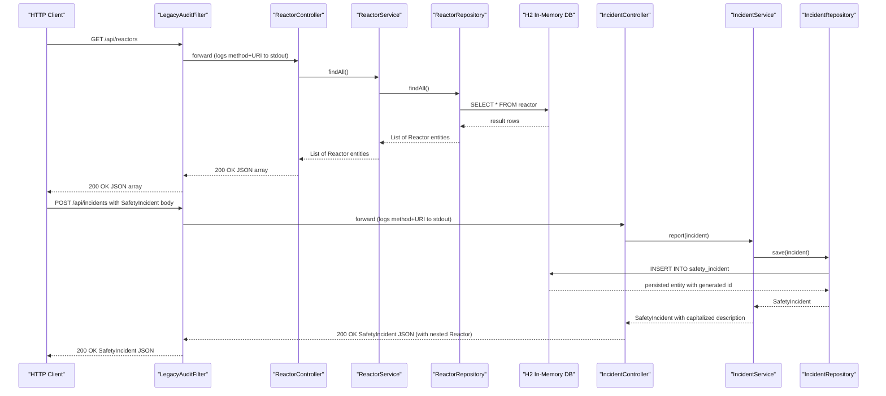

# API & Service Communication Contracts

The application exposes 12 HTTP endpoints across three REST controllers and one Thymeleaf MVC controller, all served synchronously from a single Spring Boot monolith on port 8080 with no inter-service communication.

## Service Catalog

| Service | Port | Category | Purpose |
|---------|------|----------|---------|
| sector-7g-safety-ledger | 8080 | API + Business | Reactor status tracking, safety incident management, employee directory, and HTML dashboard for the Springfield Nuclear Power Plant |

## API Endpoints Inventory

| Controller | Method | Path | Request Type | Response Type |
|------------|--------|------|-------------|---------------|
| DashboardController | GET | `/` | — | Thymeleaf view (`dashboard`) |
| EmployeeController | GET | `/api/employees` | — | `List<Employee>` (JSON) |
| EmployeeController | GET | `/api/employees/{name}` | Path variable `String` | `Employee` (JSON; returns `null` body on miss — no 404) |
| IncidentController | GET | `/api/incidents` | — | `List<SafetyIncident>` (JSON) |
| IncidentController | POST | `/api/incidents` | `SafetyIncident` (JSON body) | `SafetyIncident` (JSON) |
| IncidentController | GET | `/api/incidents/alarming` | — | `List<SafetyIncident>` (JSON, severity ≥ 4) |
| IncidentController | GET | `/api/incidents/leaderboard` | — | `Map<String,Integer>` (JSON) |
| IncidentController | GET | `/api/incidents/donuts` | — | `String` (plain text) |
| ReactorController | GET | `/api/reactors` | — | `List<Reactor>` (JSON) |
| ReactorController | GET | `/api/reactors/{id}` | Path variable `Long` | `ResponseEntity<Reactor>` (200 or 404) |
| ReactorController | POST | `/api/reactors` | `Reactor` (JSON body) | `Reactor` (JSON; no input validation) |
| ReactorController | GET | `/api/reactors/output` | — | `String` (plain text, total MW) |
| ReactorController | GET | `/api/reactors/overdue` | — | `List<Reactor>` (JSON, inspection overdue > 90 days) |

## Management & Observability Endpoints

| Endpoint | Description |
|----------|-------------|
| `/swagger-ui.html` | SpringFox 2.9.2 Swagger UI (interactive API explorer) |
| `/v2/api-docs` | SpringFox-generated OpenAPI 2.0 JSON spec |
| `/h2-console` | H2 in-browser SQL console (enabled in `application.properties`) |
| `System.out` (all requests) | `LegacyAuditFilter` prints method + URI on every request — not a formal endpoint but the sole observability mechanism |

Spring Boot Actuator is **not** present in `pom.xml`; there are no `/actuator/*` health or metrics endpoints.

## DTOs & Contracts

| Class | Role | Notes |
|-------|------|-------|
| `Employee` | Request and response for `/api/employees/**` | JPA entity serialized directly; no dedicated DTO; includes `securityClearance` field exposed in all responses |
| `Reactor` | Request and response for `/api/reactors/**` | JPA entity serialized directly; `status` is a free-text `String` (no enum constraint); `lastInspection` uses `java.util.Date` |
| `SafetyIncident` | Request and response for `/api/incidents/**` | JPA entity serialized directly; contains eagerly-loaded `Reactor` (nested JSON object on every incident response); `severity` is an undocumented `int` 1–5 |

No dedicated DTO/request/response wrapper classes exist. All three entity classes are mutable (no immutability). The SpringFox Swagger 2 spec at `/v2/api-docs` is the only machine-readable contract, generated at runtime from entity field names.

## Communication Patterns

**Synchronous only.** All client–server communication is synchronous HTTP/1.1 with JSON or HTML responses. There is no messaging, event bus, or asynchronous call path.

**No resilience patterns.** There are no circuit breakers, retries, timeouts, bulkheads, or fallbacks configured anywhere in the codebase.

**No service discovery.** The application is a single deployable unit; no registry (Eureka, Consul, etc.) is present.

**Security posture — absent.** Spring Security is not on the classpath. `LegacyAuditFilter` logs every request to `System.out` but performs no authentication or authorization. A header `X-Smithers-Token` is checked against a hardcoded backdoor constant (`SecretConstants.SMITHERS_BACKDOOR_TOKEN`) but the positive match branch only prints a log line — it grants no elevated access. The API key (`plant.api.key`) defined in `application.properties` is read into `SecretConstants` but is never validated against any incoming request. No TLS configuration is present; the application listens on plain HTTP.

**H2 console exposure.** The H2 web console (`/h2-console`) is enabled in all environments with credentials hardcoded in `application.properties`, presenting a direct database access vector.

## Service Technology Matrix

| Service | Web Framework | Data Access | Service Discovery | Actuator / Health | Caching | Metrics Export |
|---------|--------------|-------------|------------------|-------------------|---------|----------------|
| sector-7g-safety-ledger | Spring Boot 2.3 / Spring MVC (REST + Thymeleaf) | Spring Data JPA / Hibernate / H2 in-memory | None | None | None | None (System.out only) |

## Service Communication Sequence

<!-- mermaid-checked: every participant uses `participant Id as "Label"`, no \n in aliases/messages/notes, every alt/opt/loop closed by end, no `:` inside any alias -->

