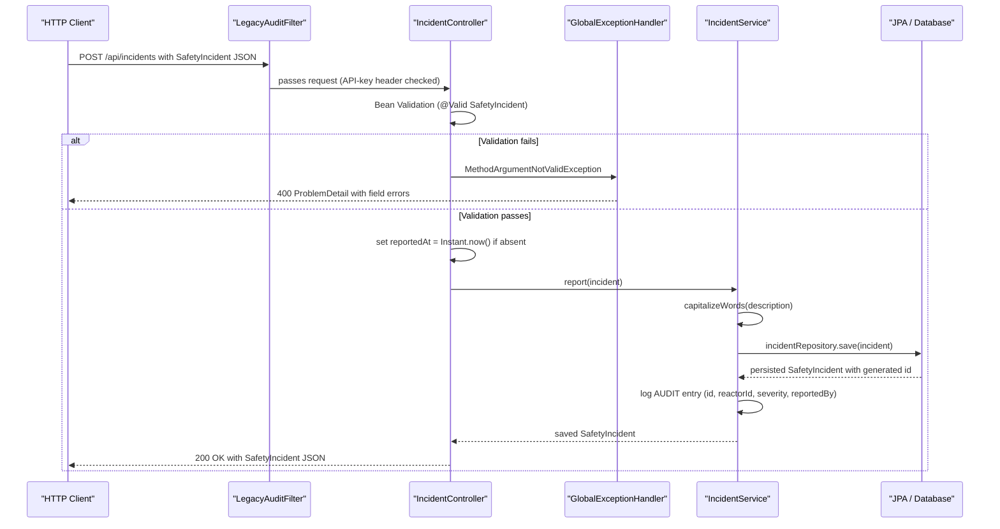

# API & Service Communication Contracts

The application exposes 13 HTTP endpoints across three REST controllers and one Thymeleaf controller, all served synchronously over HTTP/1.1 on a single deployable unit with no inter-service calls or async messaging.

---

## Service Catalog

| Service | Port | Category | Purpose | Key Framework Dependencies |
|---|---|---|---|---|
| sector-7g-safety-ledger | 8080 (configurable via `SERVER_PORT`) | API Layer + Business + Infrastructure | Springfield Nuclear Plant safety ledger — manages reactors, safety incidents, and employee records | Spring Boot 4.0.7, Spring MVC, Spring Data JPA, Thymeleaf, springdoc-openapi 2.8.9, Bean Validation |

---

## API Endpoints Inventory

| HTTP Method | Path | Request Type | Response Type | Controller | Notes |
|---|---|---|---|---|---|
| GET | `/` | — | `text/html` | `DashboardController` | Thymeleaf dashboard view; not a REST endpoint |
| GET | `/api/employees` | — | `List<Employee>` JSON | `EmployeeController` | Returns all employees; entity serialised directly — no DTO |
| GET | `/api/employees/{name}` | path param `name` | `Employee` JSON / 404 | `EmployeeController` | Lookup by name string |
| GET | `/api/reactors` | — | `List<Reactor>` JSON | `ReactorController` | Returns all reactors |
| GET | `/api/reactors/{id}` | path param `id` (Long) | `Reactor` JSON / 404 | `ReactorController` | Lookup by id |
| POST | `/api/reactors` | `Reactor` JSON (`@Valid`) | `Reactor` JSON | `ReactorController` | Creates reactor; defaults `lastInspection` to today if absent |
| GET | `/api/reactors/output` | — | `String` | `ReactorController` | Returns total online thermal output in MW |
| GET | `/api/reactors/overdue` | — | `List<Reactor>` JSON | `ReactorController` | Reactors not inspected within 90 days |
| POST | `/api/reactors/{id}/inspect` | path param `id` (Long) | `Reactor` JSON / 404 | `ReactorController` | Records inspection date; returns updated reactor |
| GET | `/api/incidents` | — | `List<SafetyIncident>` JSON | `IncidentController` | Returns all incidents |
| POST | `/api/incidents` | `SafetyIncident` JSON (`@Valid`) | `SafetyIncident` JSON | `IncidentController` | Reports new incident; defaults `reportedAt` to now if absent |
| GET | `/api/incidents/alarming` | — | `List<SafetyIncident>` JSON | `IncidentController` | Incidents with severity >= 4 |
| GET | `/api/incidents/leaderboard` | — | `Map<String, Integer>` JSON | `IncidentController` | Incident count keyed by reporter name |
| GET | `/api/incidents/donuts` | — | `String` | `IncidentController` | Total donuts consumed across all incidents |

---

## Management & Observability Endpoints

Spring Boot Actuator is **not** on the classpath. Observability is limited to the SpringDoc and H2 console endpoints activated by configuration.

| Path | Purpose | Exposed By |
|---|---|---|
| `/swagger-ui.html` | Interactive API documentation UI | springdoc-openapi-starter-webmvc-ui 2.8.9 |
| `/v3/api-docs` | OpenAPI 3 specification (JSON) | springdoc-openapi-starter-webmvc-ui 2.8.9 |
| `/h2-console` | In-memory H2 database browser | Spring Boot H2 auto-configuration (`spring.h2.console.enabled=true`) — dev only |

---

## DTOs & Contracts

No dedicated DTO or record classes exist. JPA entity classes are serialised directly as request and response bodies:

| Class | API Role | Immutability |
|---|---|---|
| `SafetyIncident` | Request body (`POST /api/incidents`) and response (`GET`, `POST /api/incidents*`) | Mutable POJO — no record, no Lombok `@Value` |
| `Reactor` | Request body (`POST /api/reactors`) and response (`GET`, `POST /api/reactors*`) | Mutable POJO |
| `Employee` | Response only (`GET /api/employees*`) | Mutable POJO |
| `Map<String, Integer>` | Response for `/api/incidents/leaderboard` (anonymous inline type) | Mutable `HashMap` instance |

All three entities are exposed directly over the wire — there is no anti-corruption layer between the persistence model and the API contract. Bean Validation annotations (`@NotBlank`, `@Min`, `@NotNull`) on the entities serve as the only input contract definition.

---

## Communication Patterns

| Pattern | Description |
|---|---|
| Synchronous REST (inbound) | All client-facing communication uses synchronous HTTP request/response over Spring MVC. No reactive or non-blocking I/O. |
| Synchronous database I/O | Spring Data JPA with Hibernate; all queries execute synchronously within a `@Transactional` service call. |
| No outbound HTTP calls | The application makes no calls to external services or APIs. |
| No async messaging | No message brokers, event publishers, or `@Async` methods are present. |
| No scheduled tasks | No `@Scheduled` annotations or cron jobs are present. |
| Data bootstrapping | `DataLoader` (in `bootstrap/`) seeds the H2 database at startup via `ApplicationRunner` or `CommandLineRunner`; not an API concern. |

---

## Error Handling & Resilience

| Mechanism | Detail |
|---|---|
| `@RestControllerAdvice` | `GlobalExceptionHandler` is the single global error handler for all REST controllers. |
| `@ExceptionHandler(MethodArgumentNotValidException.class)` | Catches Bean Validation failures from `@Valid`-annotated request bodies and returns an RFC 9457 `ProblemDetail` with HTTP 400. The detail string concatenates all field-level validation messages. |
| `ProblemDetail` (RFC 9457) | Used correctly — type set to `about:blank`, title set to `"Validation failed"`, detail contains field error list. |
| `ResponseEntity.notFound()` | `ReactorController` and `EmployeeController` return HTTP 404 inline rather than throwing; this bypasses `GlobalExceptionHandler` for the not-found case. |
| No circuit breakers | No Resilience4j, Hystrix, or similar fault-tolerance libraries are present. |
| No retry logic | No `@Retryable` or retry templates are used. |

---

## Request Flow Sequence Diagram

Primary flow: a safety officer submits a new incident report (`POST /api/incidents`).

<!-- mermaid-checked: every participant uses `participant Id as "Label"`, no \n in aliases/messages/notes, every alt/opt/loop closed by end, no `:` inside any alias -->

