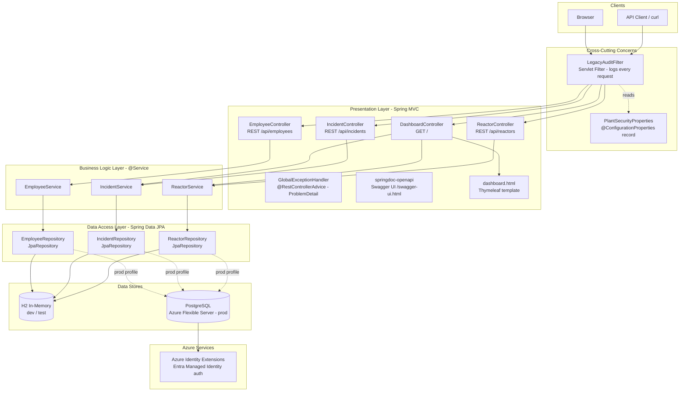
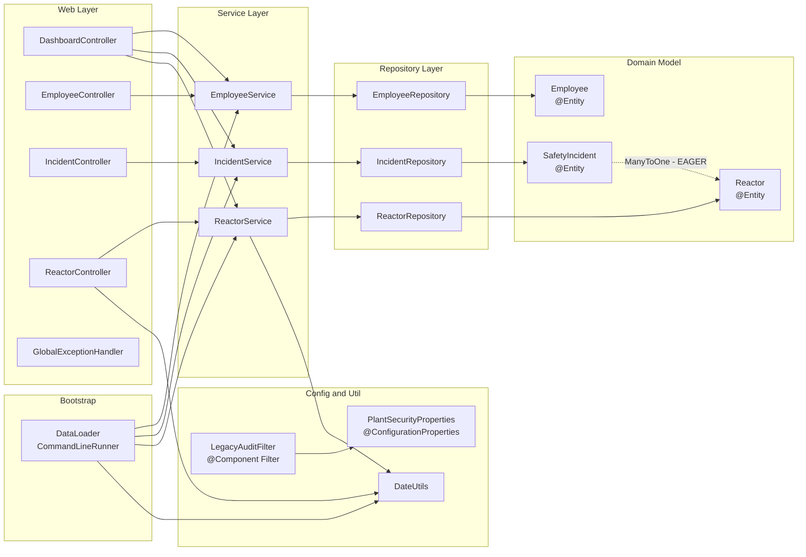

# Architecture Diagram

## Application Architecture

<!-- mermaid-checked: no \n, no em-dash/en-dash, no {} in labels, subgraphs are id["label"], arrows are -->|"label"|, all subgraphs closed by end, ids unique -->

### Technology Stack Summary

| Layer | Technology | Version | Purpose |
|---|---|---|---|
| Runtime | Java | 21 | Application runtime (target Java 25 per project guidelines) |
| Framework | Spring Boot | 4.0.7 | Auto-configuration, embedded server, BOM dependency management |
| Web | Spring MVC | 7.x (via Boot) | REST controllers, Thymeleaf MVC, servlet filter chain |
| Templating | Thymeleaf | 3.x (via Boot) | Server-side HTML rendering for the dashboard |
| ORM | Spring Data JPA / Hibernate | 7.x (via Boot) | Entity mapping, repository abstraction, transaction management |
| Embedded Server | Apache Tomcat | 11.0.24 | Servlet container (overridden from Boot BOM to patch CVE-2026-55956) |
| API Docs | springdoc-openapi | 2.8.9 | OpenAPI 3 spec generation and Swagger UI |
| Validation | Jakarta Bean Validation | 3.x (via Boot) | Input validation on request bodies and entity fields |
| Database (dev) | H2 | managed by Boot | In-memory relational database for local development and tests |
| Database (prod) | PostgreSQL | Azure Flexible Server | Persistent production database with Entra managed identity |
| Azure Auth | Azure Identity Extensions | 1.2.9 | Passwordless managed identity authentication for PostgreSQL |
| Logging | SLF4J + Logback | managed by Boot | Structured application and audit logging |
| Build | Maven | 3.x | Dependency management, build lifecycle |

### Data Storage and External Services

The application uses **H2 in-memory** as the default data store for local development and tests (configured via `spring.datasource.url` with `jdbc:h2:mem:snpp`). In production the datasource switches to **Azure Database for PostgreSQL Flexible Server** through environment variable overrides (`SPRING_DATASOURCE_URL`, `SPRING_DATASOURCE_USERNAME`). Passwords are never stored in source; the `azure-identity-extensions` library provides passwordless authentication via Entra managed identity. An H2 console is enabled for development (`spring.h2.console.enabled=true`). The DDL auto strategy is `create-drop` for H2 (ephemeral) and `update` for production Postgres to preserve schema across replica restarts.

### Key Architectural Decisions

- **Layered MVC with clear separation**: web controllers delegate to `@Service` beans which own all `@Transactional` boundaries; repositories are pure Spring Data JPA interfaces with no business logic.
- **Passwordless production database authentication**: the production database credential is resolved at runtime via `azure-identity-extensions` and Entra managed identity, eliminating stored secrets entirely.
- **Cross-cutting audit via servlet filter**: `LegacyAuditFilter` intercepts every HTTP request to log method, URI, and API key presence before the request reaches any controller, providing a single consistent audit trail.

---

## Component Relationships

<!-- mermaid-checked: no \n, no em-dash/en-dash, no {} in labels, subgraphs are id["label"], arrows are -->|"label"|, all subgraphs closed by end, ids unique -->

### Component Inventory

| Component | Type | Package | Responsibility |
|---|---|---|---|
| `DashboardController` | `@Controller` | `web` | Renders Thymeleaf dashboard at `GET /`; aggregates reactor and incident data |
| `EmployeeController` | `@RestController` | `web` | REST endpoints `GET /api/employees` and `GET /api/employees/{name}` |
| `IncidentController` | `@RestController` | `web` | REST endpoints for listing, reporting, and auditing safety incidents |
| `ReactorController` | `@RestController` | `web` | REST endpoints for reactor CRUD, output totals, overdue inspection queries, and inspection recording |
| `GlobalExceptionHandler` | `@RestControllerAdvice` | `web` | Centralised exception-to-`ProblemDetail` mapping per RFC 9457 |
| `EmployeeService` | `@Service` | `service` | Employee business logic; owns `@Transactional` boundaries for reads and writes |
| `IncidentService` | `@Service` | `service` | Incident business logic; severity audit, reporter leaderboard, donut accounting |
| `ReactorService` | `@Service` | `service` | Reactor business logic; total output, overdue inspection calculation, inspect action |
| `EmployeeRepository` | JPA repository interface | `repository` | CRUD and `findByName` query for `Employee` entities |
| `IncidentRepository` | JPA repository interface | `repository` | CRUD and `findBySeverityGreaterThanEqual` query for `SafetyIncident` entities |
| `ReactorRepository` | JPA repository interface | `repository` | CRUD, `findByStatus`, and `findBySector` queries for `Reactor` entities |
| `Employee` | `@Entity` | `model` | Persistent employee record: name, role, clearance level |
| `Reactor` | `@Entity` | `model` | Persistent reactor record: name, sector, status, thermal output, last inspection timestamp |
| `SafetyIncident` | `@Entity` | `model` | Persistent incident record; `@ManyToOne(EAGER)` relationship to `Reactor` |
| `LegacyAuditFilter` | `@Component` servlet `Filter` | `config` | Intercepts all requests; logs HTTP method, URI, and API key presence |
| `PlantSecurityProperties` | `@ConfigurationProperties` record | `config` | Binds `plant.security.*` properties; exposes `apiKeyConfigured()` predicate |
| `DataLoader` | `@Component` `CommandLineRunner` | `bootstrap` | Seeds reference data (reactors, employees, incidents) on startup; skips if data already present |
| `DateUtils` | Utility class | `util` | `Instant`-based helper: `daysAgo(n)` returns an `Instant` n days before now |

### Key Integration Points

- **Dependency injection wiring**: all inter-layer dependencies are resolved via constructor injection; no field-level `@Autowired` is used anywhere, making the dependency graph explicit and testable.
- **Transaction ownership at the service layer**: `@Transactional` annotations live exclusively on `@Service` methods; repositories and controllers carry none, enforcing a clean propagation boundary.
- **Filter chain as the single audit entry point**: `LegacyAuditFilter` is registered as a `@Component` servlet `Filter`, meaning it intercepts all URLs including Swagger UI, H2 console, and static resources - not only API paths.
- **Entity exposed directly in API responses**: both `IncidentController` and `EmployeeController` serialise JPA entities directly to JSON without a DTO layer; the `SafetyIncident` entity carries an `EAGER`-loaded `Reactor` association which triggers an N+1 query pattern on collection endpoints.
- **Cross-service aggregation in dashboard**: `DashboardController` calls both `ReactorService` and `IncidentService` within a single request to populate the Thymeleaf model; no shared transaction spans both services.
- **Startup seeding guard**: `DataLoader` queries `ReactorService.findAll()` before inserting seed rows, preventing duplicate data on repeated cold starts against a persistent Postgres instance.
