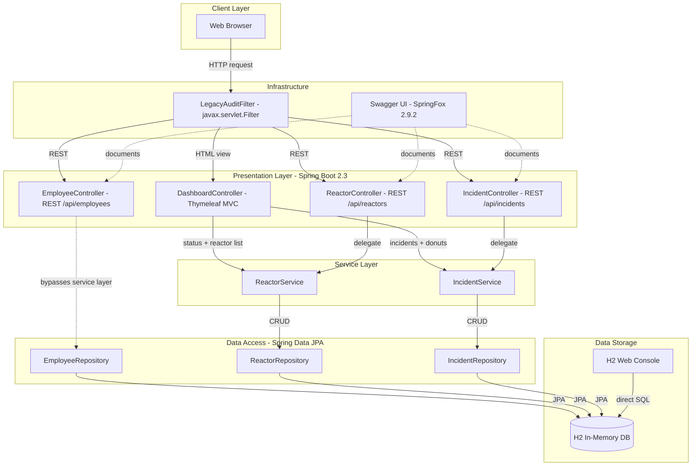
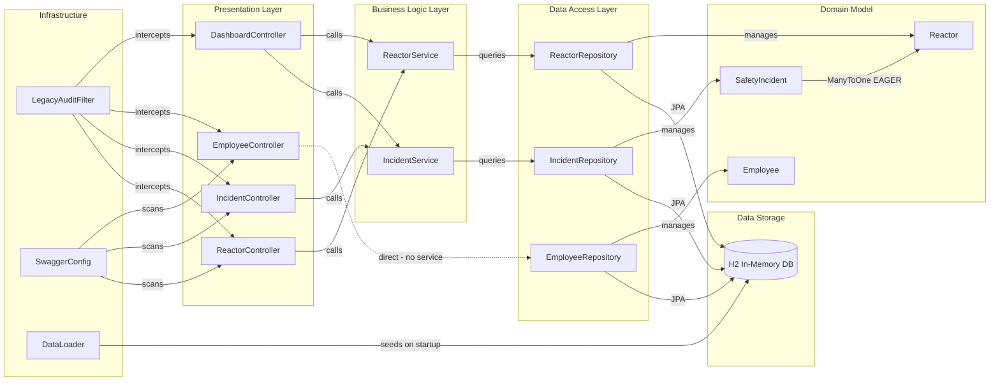

# Architecture Diagram

The Sector 7G Safety Ledger is a legacy Java 8 / Spring Boot 2.3 monolith that tracks safety incidents, reactor status, and employee records for the Springfield Nuclear Power Plant. It exposes a Thymeleaf-rendered dashboard and a set of REST APIs, backed by a single H2 in-memory database.

## Application Architecture

<!-- mermaid-checked: no \n, no em-dash/en-dash, no {} in labels, subgraphs are id["label"], arrows are -->|"label"|, all subgraphs closed by end, ids unique -->

### Technology Stack Summary

| Layer | Technology | Version | Purpose |
|-------|------------|---------|---------|
| Runtime | Java SE | 8 | Application runtime |
| Framework | Spring Boot | 2.3.12.RELEASE | Application framework and auto-configuration |
| Web | Spring MVC | 5.2.x | REST controllers and MVC dispatcher |
| Templating | Thymeleaf | 3.0.x | Server-side HTML dashboard rendering |
| ORM | Spring Data JPA / Hibernate | 2.3.x | JPA-based repository abstraction |
| Database | H2 | 1.4.x | In-memory relational data store |
| API Docs | SpringFox Swagger | 2.9.2 | REST API documentation and Swagger UI |
| Utilities | Apache Commons Text | 1.8 | Text capitalization in IncidentService |
| Utilities | Commons Collections | 3.2.1 | Legacy collection support |
| Utilities | Google Guava | 20.0 | General-purpose utilities |
| Build | Maven | 3.x | Dependency management and packaging |

### Data Storage and External Services

The application relies on a single H2 in-memory database (`jdbc:h2:mem:snpp`) as its only data store; there are no external service integrations, message brokers, or caches. The H2 web console is enabled at `/h2-console`, allowing direct SQL inspection. Because the DDL strategy is `create-drop`, all data — including the seed records loaded by `DataLoader` on startup — is lost on every application restart. Credentials are hardcoded both in `application.properties` and in the `SecretConstants` utility class.

### Key Architectural Decisions

- **Single in-memory datastore with no persistence:** H2 in-memory is used as the sole "production" database, providing no durable storage or migration path. Every restart wipes all state.
- **Layered monolith with one service-bypass antipattern:** Three of four REST controllers delegate to service classes; `EmployeeController` injects `EmployeeRepository` directly and serializes JPA entities to JSON without a service or DTO layer.
- **`javax.servlet` filter for cross-cutting audit:** All requests pass through `LegacyAuditFilter`, which logs via `System.out` and checks a hardcoded backdoor token — there is no structured logging, security framework, or real authentication mechanism.

## Component Relationships

<!-- mermaid-checked: no \n, no em-dash/en-dash, no {} in labels, subgraphs are id["label"], arrows are -->|"label"|, all subgraphs closed by end, ids unique -->

### Key Component Interactions

**LegacyAuditFilter** is a `javax.servlet.Filter` registered as a Spring `@Component`. It intercepts every incoming HTTP request, logs method and URI via `System.out` (no structured logging framework), and checks for an `X-Smithers-Token` header containing a hardcoded backdoor token. The filter passes all requests through regardless of the token check — it grants no access control.

**DashboardController** is the sole Thymeleaf (non-REST) controller. It composes data from both `ReactorService` (plant status banner and full reactor list) and `IncidentService` (incident list and total donut count) before rendering the `dashboard.html` template. It has no direct repository dependency.

**EmployeeController** is an architectural anomaly: it injects `EmployeeRepository` directly, bypassing any service layer. JPA `Employee` entities are serialized directly to JSON, exposing the internal entity structure — including the `securityClearance` field — to API consumers with no DTO transformation.

**ReactorService** and **IncidentService** encapsulate the application's business logic. `ReactorService` computes total online output via manual indexed loops and deprecated `new Integer(...)` boxing. `IncidentService` builds a reporter leaderboard using the legacy `Hashtable` type and uses Apache Commons Text 1.8 (`WordUtils.capitalizeFully`) to normalize incident descriptions.

**SafetyIncident** holds a `@ManyToOne(fetch = FetchType.EAGER)` relationship to `Reactor`. This means every incident query eagerly loads its associated reactor, creating a potential N+1 query problem when listing all incidents.

**DataLoader** implements `CommandLineRunner` and directly injects all three repositories to seed `Reactor`, `Employee`, and `SafetyIncident` records at application startup. Because H2 uses `create-drop` DDL, this seed load executes on every restart.

**SwaggerConfig** uses `@EnableSwagger2` with SpringFox 2.9.2 to expose a Swagger UI at `/swagger-ui.html`. This library is abandoned and incompatible with Spring Boot 3, requiring replacement with `springdoc-openapi` during any upgrade.
