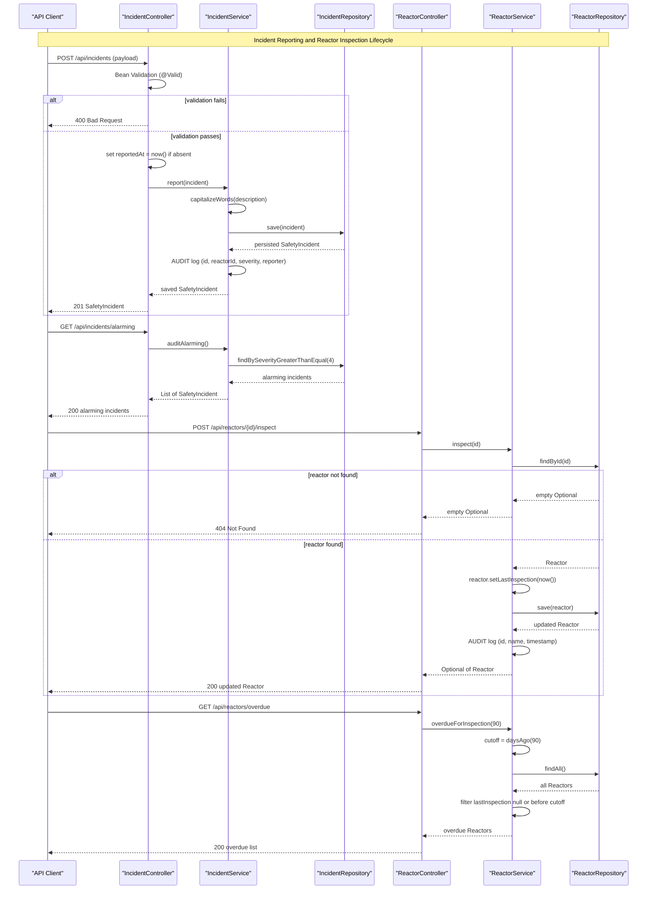

# Core Business Workflows

The Sector 7G Safety Ledger is a nuclear plant operations management system that tracks reactor status, records safety incidents, and maintains a workforce registry so plant staff can monitor reactor health and incident history in real time.

---

## Domain Entities

| Entity | Description | Bounded Context | Key Business Relationships |
|---|---|---|---|
| Reactor | A physical reactor core in the plant, characterized by its operational status and thermal output in megawatts | Reactor Operations | Owned by a sector; referenced by many SafetyIncidents |
| SafetyIncident | A recorded safety event at the plant, classified by severity and linked to the responsible reactor | Safety Incident Tracking | Belongs to exactly one Reactor; reported by an Employee (by name, not foreign key) |
| Employee | A plant worker with a named role and security clearance level | Workforce Management | Identified by name; referenced loosely by SafetyIncident.reportedBy |

---

## Service-to-Domain Mapping

| Service | Bounded Context | Owned Domain Entities | Cross-Context Interactions |
|---|---|---|---|
| ReactorService | Reactor Operations | Reactor | Queried by DashboardController and DataLoader; Reactor IDs referenced by IncidentService via SafetyIncident |
| IncidentService | Safety Incident Tracking | SafetyIncident | Reads Reactor (via eager join on SafetyIncident); aggregated by DashboardController alongside ReactorService |
| EmployeeService | Workforce Management | Employee | Called only by DataLoader during seed; not composed with other services at runtime |

---

## Primary Workflows

### 1. Report a Safety Incident

**Entry point:** `POST /api/incidents`

**Steps:**
1. Controller receives `SafetyIncident` payload and triggers Bean Validation (`@Valid`).
2. If `reportedAt` is absent, controller sets it to the current instant.
3. `IncidentService.report()` normalizes the description via `capitalizeWords` (each word: first letter upper, rest lower).
4. Incident is persisted via `IncidentRepository.save()`.
5. An audit log line is emitted at INFO level recording id, reactor id, severity, and reporter.

**Business rules applied:**
- `description`, `reportedBy` must not be blank.
- `severity` must be at least 1.
- Timestamp defaults to submission time if not supplied by the caller.
- Description text is always normalized regardless of how it was submitted.

**Outcome:** Persisted `SafetyIncident` returned; audit trail written to application log.

---

### 2. Register a Reactor

**Entry point:** `POST /api/reactors`

**Steps:**
1. Controller receives `Reactor` payload and triggers Bean Validation (`@Valid`).
2. If `lastInspection` is absent, controller sets it to the current instant (`DateUtils.daysAgo(0)`).
3. `ReactorService.save()` persists the reactor.
4. Audit log line emitted at INFO level recording id, name, sector, status, and thermal output.

**Business rules applied:**
- `name`, `sector`, `status` must not be blank.
- `thermalOutputMw` must not be null and must be >= 0.
- New reactors without an explicit inspection date are considered inspected today.

**Outcome:** Persisted `Reactor` returned; audit trail written.

---

### 3. Record a Reactor Inspection

**Entry point:** `POST /api/reactors/{id}/inspect`

**Steps:**
1. Controller resolves reactor by id via `ReactorService.inspect(id)`.
2. If reactor exists, `lastInspection` is stamped to the current instant.
3. Updated reactor is persisted and an audit log entry emitted.
4. If no reactor found for the id, HTTP 404 is returned.

**Business rules applied:**
- Inspection is only valid for an existing reactor.
- Inspection timestamp is always overwritten with the current time (no historical backdating).

**Outcome:** Updated `Reactor` with refreshed `lastInspection` returned; reactor removed from overdue list for the next 90 days.

---

### 4. Overdue Inspection Identification

**Entry point:** `GET /api/reactors/overdue`

**Steps:**
1. `ReactorService.overdueForInspection(90)` computes the cutoff as 90 days before now via `DateUtils.daysAgo(90)`.
2. All reactors are fetched and filtered: a reactor is overdue if `lastInspection` is null or before the cutoff.

**Business rules applied:**
- Null `lastInspection` is treated as never inspected, hence always overdue.
- Overdue threshold is hardcoded at 90 days.

**Outcome:** List of reactors requiring immediate inspection.

---

### 5. Alarming Incident Audit

**Entry point:** `GET /api/incidents/alarming`

**Steps:**
1. `IncidentService.auditAlarming()` delegates to `IncidentRepository.findBySeverityGreaterThanEqual(4)`.
2. All incidents at severity 4 or 5 are returned.

**Business rules applied:**
- Severity levels 4 ("Release the hounds") and 5 ("EVERYBODY OUT") are classified as alarming.

**Outcome:** Subset of incidents requiring management attention.

---

### 6. Dashboard Aggregation

**Entry point:** `GET /`

**Steps:**
1. `DashboardController.dashboard()` calls both `ReactorService` and `IncidentService`.
2. `ReactorService.statusBanner()` composes a plant-status string counting ONLINE and MELTDOWN-ISH reactors plus total online output in MW.
3. Full reactor list, full incident list, and total donuts tally are added to the Thymeleaf model.
4. Template `dashboard.html` is rendered.

**Business rules applied:**
- Banner counts reactors by status literals `"ONLINE"` and `"MELTDOWN-ISH"` (case-sensitive).
- Total donut count is a running sum across all incidents.

**Outcome:** Rendered HTML dashboard showing plant health at a glance.

---

### 7. Application Startup Seed (DataLoader)

**Entry point:** `CommandLineRunner.run()` at application startup

**Steps:**
1. `DataLoader` checks if any reactors already exist via `ReactorService.findAll()`.
2. If the database is non-empty, seeding is skipped and a log entry is written.
3. If empty, four reactors, four employees, and five incidents are created through the service layer using the same transactional paths as API callers.

**Business rules applied:**
- Seed guard prevents duplicate data across restarts or replica scale-ups.
- Seed data exercises all reactor status values (`ONLINE`, `MELTDOWN-ISH`, `OFFLINE`) and a range of severity levels (2 through 5).

**Outcome:** Populated database ready for demonstration or initial operation.

---

## Cross-Service Data Flows

### Dashboard Composition

`DashboardController` orchestrates two independent service calls before rendering:

```
DashboardController
  --> ReactorService.statusBanner()
        --> ReactorRepository.findByStatus("ONLINE")   [x2: count + sum MW]
        --> ReactorRepository.findByStatus("MELTDOWN-ISH")
  --> ReactorService.findAll()
        --> ReactorRepository.findAll()
  --> IncidentService.findAll()
        --> IncidentRepository.findAll()                [eager-loads Reactor per row]
  --> IncidentService.totalDonuts()
        --> IncidentRepository.findAll()                [second full scan]
```

`IncidentRepository.findAll()` is called twice for a single dashboard page load: once in `findAll()` and once in `totalDonuts()`. Because `SafetyIncident` loads its `Reactor` eagerly, each incident fetch also pulls reactor rows, creating an implicit cross-context read.

### Incident Reporter Leaderboard

`IncidentService.incidentsPerReporter()` performs in-memory aggregation: it loads all incidents and groups them by `reportedBy` string using `HashMap.merge`. The aggregation is not database-delegated.

### Reactor Output Calculation

`ReactorService.totalOnlineOutputMw()` fetches all ONLINE reactors and streams their `thermalOutputMw` values to a sum. This is consumed both standalone (`GET /api/reactors/output`) and embedded in `statusBanner()`.

---

## Business Workflow Sequence

<!-- mermaid-checked: every participant uses `participant Id as "Label"`, no \n in aliases/messages/notes, every alt/opt/loop closed by end, no `:` inside any alias -->



---

## Business Rules & Decision Logic

| Rule | Applies To | Logic | Location |
|---|---|---|---|
| Description must not be blank | SafetyIncident | `@NotBlank` constraint; rejected at controller boundary | `SafetyIncident.description`, `IncidentController` |
| Reporter must not be blank | SafetyIncident | `@NotBlank` constraint; rejected at controller boundary | `SafetyIncident.reportedBy`, `IncidentController` |
| Severity minimum 1 | SafetyIncident | `@Min(1)` constraint; rejected at controller boundary | `SafetyIncident.severity`, `IncidentController` |
| Timestamp defaults to now | SafetyIncident | If `reportedAt == null`, controller sets `Instant.now()` before delegating to service | `IncidentController.report()` |
| Description normalization | SafetyIncident | Each word: first char upper-cased, remaining chars lower-cased, joined with spaces | `IncidentService.capitalizeWords()` |
| Alarming severity threshold | SafetyIncident | Severity >= 4 ("Release the hounds" or "EVERYBODY OUT") classifies an incident as alarming | `IncidentService.auditAlarming()`, `IncidentRepository.findBySeverityGreaterThanEqual(4)` |
| Reactor name must not be blank | Reactor | `@NotBlank` constraint | `Reactor.name` |
| Reactor sector must not be blank | Reactor | `@NotBlank` constraint | `Reactor.sector` |
| Reactor status must not be blank | Reactor | `@NotBlank` constraint; valid values are `ONLINE`, `OFFLINE`, `MELTDOWN-ISH` (by convention, not enum) | `Reactor.status` |
| Thermal output must be non-negative | Reactor | `@NotNull` + `@Min(0)` constraint | `Reactor.thermalOutputMw` |
| New reactor inspection defaults to today | Reactor | If `lastInspection == null`, controller sets `DateUtils.daysAgo(0)` | `ReactorController.create()` |
| Inspection overwrites timestamp | Reactor | `inspect()` always stamps current time; no backdating | `ReactorService.inspect()` |
| Overdue threshold is 90 days | Reactor | Reactor is overdue if `lastInspection` is null or before `now - 90 days` | `ReactorService.overdueForInspection(90)`, `ReactorController.overdue()` |
| Online output excludes null MW values | Reactor | `totalOnlineOutputMw()` filters out null thermalOutputMw before summing | `ReactorService.totalOnlineOutputMw()` |
| Status banner uses case-sensitive literals | Reactor | `findByStatus("ONLINE")` and `findByStatus("MELTDOWN-ISH")` are exact-match queries | `ReactorService.statusBanner()` |
| Seed guard prevents duplicate data | DataLoader | If `reactorService.findAll()` is non-empty, the entire seed routine is skipped | `DataLoader.run()` |
