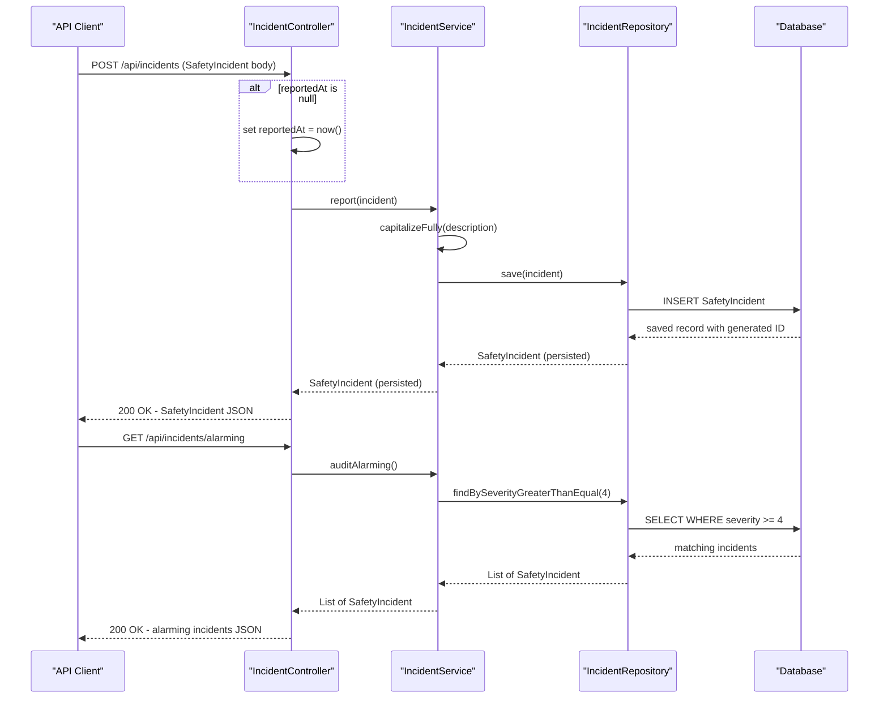

# Core Business Workflows

The Springfield Nuclear Power Plant (SNPP) management system tracks nuclear reactor operational status and safety incidents across plant sectors, enabling operators to monitor reactor health, report hazards, and surface aggregated plant safety metrics on a unified dashboard.

## Domain Entities

| Entity | Service / Bounded Context | Description | Key Relationships |
|---|---|---|---|
| Reactor | Reactor Operations | A nuclear reactor core identified by name and sector. Carries an operational status and a thermal output rating. Tracks the date of its most recent safety inspection. | Parent of SafetyIncident (one-to-many) |
| SafetyIncident | Safety Management | A recorded safety event at the plant. Captures a severity rating, a free-text description, the reporting employee, the timestamp, and the number of donuts consumed during the response. | Child of Reactor (many-to-one) |
| Employee | Personnel Management | A plant staff member with a named role and a security clearance level. Used as the reporter identity on safety incidents. | Referenced by SafetyIncident via reportedBy (string association) |

## Service-to-Domain Mapping

| Service | Domain Context | Owned Entities | External Dependencies |
|---|---|---|---|
| ReactorService | Reactor Operations | Reactor | ReactorRepository, DateUtils |
| IncidentService | Safety Management | SafetyIncident | IncidentRepository |
| EmployeeController (no service) | Personnel Management | Employee | EmployeeRepository (direct — no service layer) |
| DashboardController | Cross-Domain Aggregation | None (read-only composition) | ReactorService, IncidentService |

## Primary Workflows

### Workflow 1: Reactor Status Monitoring

Operators query the current operational state of all reactor cores. The system returns each reactor's name, sector, status label, thermal output, and last inspection date.

**Steps:**
1. Client calls `GET /api/reactors`.
2. `ReactorController` delegates to `ReactorService.findAll()`.
3. `ReactorService` fetches all rows from `ReactorRepository`.
4. The full list is serialised and returned.

**Variant — Lookup by ID:**
1. Client calls `GET /api/reactors/{id}`.
2. `ReactorService.findById(id)` queries the repository; if no match, returns `null`.
3. `ReactorController` translates `null` → HTTP 404, a found reactor → HTTP 200.

**Variant — Total Online Output:**
1. Client calls `GET /api/reactors/output`.
2. `ReactorService.totalOnlineOutputMw()` queries for all reactors with status `"ONLINE"` and sums their `thermalOutputMw` values.
3. Returns a plain-text summary string.

**Variant — Overdue Inspection Report:**
1. Client calls `GET /api/reactors/overdue`.
2. `ReactorService.overdueForInspection(90)` computes a cutoff date 90 days in the past.
3. All reactors whose `lastInspection` is `null` or earlier than the cutoff are collected and returned.

**Variant — New Reactor Registration:**
1. Client calls `POST /api/reactors` with a `Reactor` JSON body.
2. If `lastInspection` is absent, `ReactorController` defaults it to today via `DateUtils.daysAgo(0)`.
3. `ReactorService.save(reactor)` persists the entity and returns the saved record.
4. No input validation is applied (negative megawatt values are accepted).

### Workflow 2: Safety Incident Reporting and Management

Staff report new safety events at the plant. The system timestamps and normalises the incident description before persisting it.

**Steps:**
1. Client calls `POST /api/incidents` with a `SafetyIncident` JSON body.
2. `IncidentController` checks whether `reportedAt` is `null`; if so, it stamps the current date/time.
3. `IncidentService.report(incident)` applies title-case formatting to the description (via `WordUtils.capitalizeFully`) for audit readability.
4. `IncidentRepository.save(incident)` persists the record (with the associated `Reactor` resolved by ID).
5. The saved incident is returned to the caller.

**Variant — List All Incidents:**
1. Client calls `GET /api/incidents`.
2. `IncidentService.findAll()` returns every recorded incident. Each incident eagerly loads its parent `Reactor`.

**Variant — Alarming Incidents Audit:**
1. Client calls `GET /api/incidents/alarming`.
2. `IncidentService.auditAlarming()` delegates to `IncidentRepository.findBySeverityGreaterThanEqual(4)`.
3. All incidents with severity 4 ("Release the hounds") or 5 ("EVERYBODY OUT") are returned.

**Variant — Reporter Leaderboard:**
1. Client calls `GET /api/incidents/leaderboard`.
2. `IncidentService.incidentsPerReporter()` loads all incidents, iterates manually, and accumulates a count per `reportedBy` value.
3. Returns a map of reporter name → incident count.

**Variant — Donut Counter:**
1. Client calls `GET /api/incidents/donuts`.
2. `IncidentService.totalDonuts()` sums `donutsConsumedDuringIncident` across all incidents.
3. Returns a human-readable string (e.g., "Donuts consumed during incidents to date: 22 🍩").

### Workflow 3: Employee Management

Personnel records are queried for roster and individual employee lookups.

**Steps — List all employees:**
1. Client calls `GET /api/employees`.
2. `EmployeeController` calls `EmployeeRepository.findAll()` directly (no service layer).
3. All employee entities, including security clearance values, are serialised and returned.

**Steps — Lookup by name:**
1. Client calls `GET /api/employees/{name}`.
2. `EmployeeRepository.findByName(name)` performs an exact-match query.
3. If no match, `null` is returned and the response is HTTP 200 with an empty body (no 404 guard).

### Workflow 4: Dashboard Data Aggregation

The plant operations dashboard combines reactor and incident data into a single server-rendered view for operators.

**Steps:**
1. Operator requests `GET /`.
2. `DashboardController.dashboard()` calls:
   - `ReactorService.statusBanner()` → a summary string: "SNPP STATUS :: N online / N melting / N MW total."
   - `ReactorService.findAll()` → full reactor list for the status table.
   - `IncidentService.findAll()` → full incident list (each with its eagerly-loaded reactor).
   - `IncidentService.totalDonuts()` → aggregate donut KPI.
3. All four values are bound to the Thymeleaf model and rendered in `dashboard.html`.

## Cross-Service Data Flows

**Incident → Reactor association:** Every `SafetyIncident` carries a `Reactor` reference resolved at query time (EAGER fetch). When the incident list is loaded by `IncidentService` or `IncidentController`, the associated reactor data is pulled automatically, coupling the Safety Management and Reactor Operations bounded contexts at the persistence layer rather than through explicit service calls.

**Dashboard composition:** `DashboardController` is the single point of cross-domain data composition. It calls both `ReactorService` and `IncidentService` independently and merges results in the view model. There is no shared domain event or integration layer — the dashboard acts as an ad-hoc orchestrator.

**Reporter identity:** The `reportedBy` field on `SafetyIncident` is a plain string copied from the submitter at report time. It is not a foreign-key reference to the `Employee` entity, so employee records and incident records are decoupled in the data model but informally correlated through matching name strings.

## Business Workflow Sequence

<!-- mermaid-checked: every participant uses `participant Id as "Label"`, no \n in aliases/messages/notes, every alt/opt/loop closed by end, no `:` inside any alias -->

## Business Rules & Decision Logic

### Business Rules

| Rule | Location | Description |
|---|---|---|
| Auto-timestamp on report | `IncidentController.report()` | If `reportedAt` is absent from the request body, it is set to the current date and time before the incident is saved. |
| Description normalisation | `IncidentService.report()` | The incident description is converted to title case (e.g., "glow in the dark rat" → "Glow In The Dark Rat") before persistence. |
| Alarming severity threshold | `IncidentService.auditAlarming()` | Incidents with severity >= 4 are classified as alarming and surfaced in the audit endpoint. |
| Severity scale | `IncidentService.severityLabels()` | Five levels: 1 = Meh, 2 = D'oh, 3 = Ay caramba, 4 = Release the hounds, 5 = EVERYBODY OUT. The mapping is undocumented and lives only in code. |
| Online-only output aggregation | `ReactorService.totalOnlineOutputMw()` | Thermal output is summed only for reactors with status `"ONLINE"`. OFFLINE and MELTDOWN-ISH reactors are excluded. |
| Overdue inspection window | `ReactorService.overdueForInspection(90)` | A reactor is overdue if its `lastInspection` is `null` or older than 90 days from the current date. |
| Default inspection date on create | `ReactorController.create()` | If a new reactor is submitted without a `lastInspection` date, it is defaulted to today. |
| Reactor status values | `Reactor` model | Status is a free-text string. Expected values are `ONLINE`, `OFFLINE`, and `MELTDOWN-ISH`; no enforcement or enumeration exists. |
| Negative output accepted | `ReactorController.create()` | No validation on `thermalOutputMw`; negative or zero values are persisted without error. |
| Employee name lookup — null return | `EmployeeController.byName()` | If no employee matches the given name, the repository returns `null` and the controller returns HTTP 200 with an empty body rather than HTTP 404. |
| Security clearance — untyped | `Employee` model | Security clearance is a plain string; no enumeration, ranking, or access-control enforcement exists. |

### Cross-Cutting Concerns

**Transactions:** No explicit `@Transactional` annotations are present. Spring Data JPA applies per-call transaction semantics on each repository method. Multi-step workflows (e.g., incident report with timestamp mutation) are not wrapped in a single transaction.

**Error handling:** There is no global exception handler (`@ControllerAdvice`). Null returns from service methods (e.g., `findById`) are handled locally in `ReactorController`; elsewhere, a `NullPointerException` would propagate as an HTTP 500. The `DateUtils.parse()` method silently swallows `ParseException` and returns the current date, masking malformed date input.

**Audit / Logging:** There is no application-level audit log for incident creation or reactor state changes. A `LegacyAuditFilter` class exists in the config package (referenced in the project structure) but its behaviour is not captured in the service or controller layer. Boot startup emits a single console line confirming record counts via `System.out.println`.

**Authorization:** No authentication or role-based access control is applied at any layer. All REST endpoints and the dashboard are publicly accessible. Security clearance data is stored on employees but never evaluated.

**Date handling:** `DateUtils` exposes a static, shared `SimpleDateFormat` instance (`PLANT_FORMAT = "yyyy-MM-dd HH:mm"`). This is not thread-safe; concurrent formatting or parsing calls can produce corrupted date values under load.
