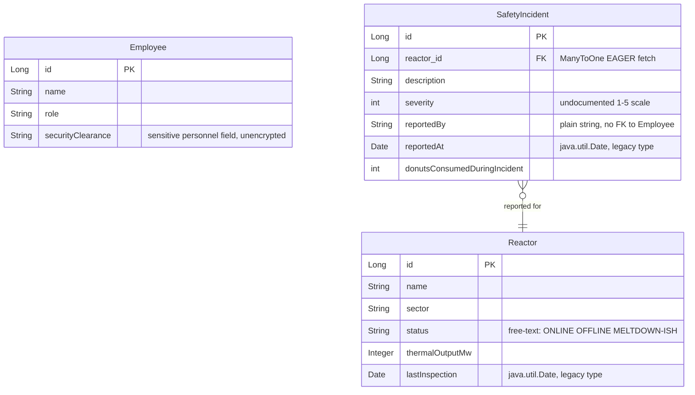

# Data Architecture & Persistence Layer

The application manages three JPA entities (Employee, Reactor, SafetyIncident) persisted via Hibernate/Spring Data JPA to a single H2 in-memory database using the legacy `javax.persistence` namespace (Spring Boot 2.3, Java 8).

## Database Configuration

| Profile | Database | Driver | Connection | Migration Tool | Schema Management |
|---------|----------|--------|------------|----------------|-------------------|
| default (all) | H2 in-memory | H2 embedded | `jdbc:h2:mem:snpp;DB_CLOSE_DELAY=-1` | None | `create-drop` — schema recreated on each startup, all data lost on restart |

Additional configuration notes:
- H2 web console enabled (`spring.h2.console.enabled=true`), accessible over HTTP with no extra auth gate
- SQL logging enabled (`spring.jpa.show-sql=true`), emitting all queries to stdout
- Database credentials hardcoded in `application.properties` in source control (username `mr.burns`, plaintext password)
- No Flyway or Liquibase; Hibernate DDL auto fully controls schema lifecycle
- Seed data loaded at startup by `DataLoader` (Spring `CommandLineRunner`)

## Data Ownership per Service

| Module | Entities Owned | ORM | Caching | Notes |
|--------|----------------|-----|---------|-------|
| ReactorService | Reactor | Hibernate via Spring Data JPA (`javax.persistence`) | None | No `@Transactional`; deprecated `new Integer()` boxing; null-returning `orElse(null)` API |
| IncidentService | SafetyIncident | Hibernate via Spring Data JPA (`javax.persistence`) | None | No `@Transactional`; uses legacy `Hashtable`; EAGER-loads Reactor on every incident fetch |
| (no dedicated service) | Employee | Hibernate via Spring Data JPA (`javax.persistence`) | None | Accessed directly from controllers via `EmployeeRepository`; no service enforces business rules |

## Entity Model

<!-- mermaid-checked: every attribute is `<type> <name> [<key>] ["<description>"]` with at most one of PK/FK/UK, no \n in descriptions, no {} in descriptions, every relationship label is double-quoted -->

### Entity Descriptions

**Employee** — Represents plant staff. `securityClearance` is a plain `String` with no enumeration, validation, or encryption. No relationship to `SafetyIncident` exists in the data model; incidents reference reporters by a raw string name only.

**Reactor** — Represents a reactor core. `status` is a free-text `String` with no enum constraint (expected values: `ONLINE`, `OFFLINE`, `MELTDOWN-ISH`). `lastInspection` uses the deprecated `java.util.Date`. No bi-directional association to `SafetyIncident` is mapped.

**SafetyIncident** — Represents a safety event. Many incidents can belong to one Reactor (`@ManyToOne(fetch = FetchType.EAGER)`), meaning every incident query triggers a Reactor SELECT. `reportedBy` is a plain `String` and carries no referential integrity to `Employee`.

## Key Repository Methods

### EmployeeRepository (`JpaRepository<Employee, Long>`)

| Method | Return Type | Purpose |
|--------|-------------|---------|
| `findAll()` | `List<Employee>` | Retrieve all employees (inherited) |
| `findById(Long id)` | `Optional<Employee>` | Retrieve employee by primary key (inherited) |
| `save(Employee)` | `Employee` | Insert or update employee record (inherited) |
| `deleteById(Long id)` | `void` | Delete employee by primary key (inherited) |
| `findByName(String name)` | `Employee` | Lookup single employee by name; returns `null` if not found |

### IncidentRepository (`JpaRepository<SafetyIncident, Long>`)

| Method | Return Type | Purpose |
|--------|-------------|---------|
| `findAll()` | `List<SafetyIncident>` | Retrieve all incidents, each with EAGER-loaded Reactor (inherited) |
| `findById(Long id)` | `Optional<SafetyIncident>` | Retrieve incident by primary key (inherited) |
| `save(SafetyIncident)` | `SafetyIncident` | Insert or update incident record (inherited) |
| `findBySeverityGreaterThanEqual(int severity)` | `List<SafetyIncident>` | Filter incidents at or above the given severity threshold |
| `findByReportedBy(String reportedBy)` | `List<SafetyIncident>` | Retrieve all incidents logged under a specific reporter name string |

### ReactorRepository (`JpaRepository<Reactor, Long>`)

| Method | Return Type | Purpose |
|--------|-------------|---------|
| `findAll()` | `List<Reactor>` | Retrieve all reactors (inherited) |
| `findById(Long id)` | `Optional<Reactor>` | Retrieve reactor by primary key (inherited) |
| `save(Reactor)` | `Reactor` | Insert or update reactor record (inherited) |
| `findByStatus(String status)` | `List<Reactor>` | Filter reactors by exact free-text status value |
| `findBySector(String sector)` | `List<Reactor>` | Filter reactors by sector name |

## Caching Strategy

No caching layer is present. All reads go directly to the H2 in-memory database via Hibernate. No Spring Cache abstraction, no Caffeine, no Redis, and no Hibernate second-level cache is configured. Because the datastore is in-memory and the application is assumed to be single-instance, this is not an immediate correctness issue; however, it becomes a critical gap when migrating to a persistent database in a multi-instance deployment — queries such as `incidentsPerReporter()` (full table scan) and the repeated `findByStatus` calls in `statusBanner()` will be expensive without caching.

## Data Ownership Boundaries

**Data-store topology:** A single H2 in-memory database serves the entire application. All three entities share one schema under one connection pool. Data is non-persistent; a restart wipes all records (mitigated only by `DataLoader` seed data).

**Cross-service access:** `IncidentService` owns `IncidentRepository` exclusively. `ReactorService` owns `ReactorRepository` exclusively. The `Employee` aggregate has no owning service; controllers access `EmployeeRepository` directly, meaning no single boundary enforces business rules on employee mutations.

**Data classification and sensitivity:**

| Field | Classification | Risk |
|-------|---------------|------|
| `Employee.securityClearance` | Sensitive personnel data | Stored as unencrypted plaintext; no field-level access control |
| `application.properties` credentials | Secret — DB username and password | Hardcoded in source control; must be externalized to a secrets manager |
| `plant.api.key` / `plant.audit.backdoor` | Secret — application keys | Hardcoded in source control; exposed via version history |
| `SafetyIncident.reportedBy` | Operational PII (employee name) | Free-text string with no referential integrity to `Employee` |
| H2 console | Internal tool | Enabled in all environments; exposes full schema over HTTP behind only the hardcoded credentials |
