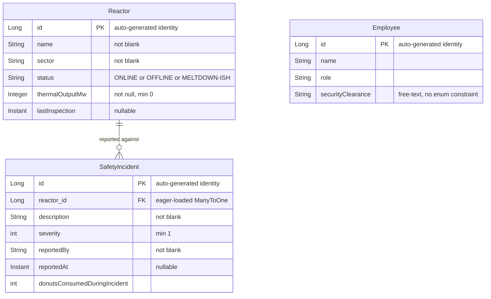

# Data Architecture & Persistence Layer

The application uses Spring Data JPA with Hibernate as the ORM to persist three entities (`Reactor`, `Employee`, `SafetyIncident`) into an H2 in-memory database for development and a PostgreSQL-compatible relational database in production, with schema management delegated to Hibernate DDL auto.

---

## Database Configuration

| Property | Value | Description |
|---|---|---|
| Database type (dev) | H2 in-memory | Default when no `SPRING_DATASOURCE_URL` env var is set |
| JDBC URL (dev) | `jdbc:h2:mem:snpp;DB_CLOSE_DELAY=-1` | Named in-memory database kept alive for the JVM lifetime |
| Username | `sa` (default) | Resolved from `SPRING_DATASOURCE_USERNAME` env var |
| Password | empty (default) | Resolved from `SPRING_DATASOURCE_PASSWORD` env var |
| Database type (prod) | PostgreSQL | Supplied via `SPRING_DATASOURCE_URL` in Azure Container App |
| ORM | Hibernate (via spring-boot-starter-data-jpa) | Version managed by Spring Boot BOM |
| DDL auto (dev) | `create-drop` | Schema created on startup, dropped on shutdown |
| DDL auto (prod) | `update` | Overridden via `SPRING_JPA_HIBERNATE_DDL_AUTO` env var; schema preserved across restarts |
| SQL logging | enabled | `spring.jpa.show-sql=true` — all generated SQL printed to stdout |
| H2 web console | enabled | Available at `/h2-console` in dev; must be disabled in production |
| Schema scripts | none | No `schema.sql` or `data.sql`; schema and seed data are code-driven |
| Seed data | `DataLoader` (CommandLineRunner) | Programmatic seed via service layer; idempotent guard checks for existing rows |
| Migration tool | none | No Flyway or Liquibase; schema is fully managed by Hibernate DDL auto |

---

## Data Ownership per Service

| Module / Package | Owned Entities | ORM Framework | Caching Layer | Notes |
|---|---|---|---|---|
| `com.springfield.plant.service` + `model` + `repository` | Reactor, Employee, SafetyIncident | Spring Data JPA / Hibernate | None | Single module; all entities share one datasource and one EntityManager |

---

## Entity Model

<!-- mermaid-checked: every attribute is `<type> <name> [<key>] ["<description>"]` with at most one of PK/FK/UK, no \n in descriptions, no {} in descriptions, every relationship label is double-quoted -->

### Entity Details

#### Reactor

| Field | Type | Constraint | Description |
|---|---|---|---|
| id | Long | PK, auto identity | Surrogate primary key |
| name | String | `@NotBlank` | Human-readable reactor name |
| sector | String | `@NotBlank` | Plant sector identifier |
| status | String | `@NotBlank` | Operational status; valid values are `ONLINE`, `OFFLINE`, `MELTDOWN-ISH` — enforced only by application logic, not a DB constraint |
| thermalOutputMw | Integer | `@NotNull`, `@Min(0)` | Current thermal output in megawatts |
| lastInspection | Instant | nullable | Timestamp of last inspection; used for overdue detection |

#### Employee

| Field | Type | Constraint | Description |
|---|---|---|---|
| id | Long | PK, auto identity | Surrogate primary key |
| name | String | none | Employee full name |
| role | String | none | Job title or role |
| securityClearance | String | none | Free-text clearance level; no enum constraint or validation |

#### SafetyIncident

| Field | Type | Constraint | Description |
|---|---|---|---|
| id | Long | PK, auto identity | Surrogate primary key |
| reactor | Reactor | `@ManyToOne(fetch=EAGER)` | Owning reactor; nullable at DB level (no `@JoinColumn(nullable=false)`) |
| description | String | `@NotBlank` | Incident description; normalized to title-case on save |
| severity | int | `@Min(1)` | Severity 1-5; upper bound not enforced by constraint |
| reportedBy | String | `@NotBlank` | Name of reporting employee; free text, no FK to Employee |
| reportedAt | Instant | nullable | Timestamp of report |
| donutsConsumedDuringIncident | int | none | Donuts consumed during the incident |

---

## Repository Layer

| Repository | Entity | Extends | Custom Methods | Notes |
|---|---|---|---|---|
| `EmployeeRepository` | `Employee` | `JpaRepository<Employee, Long>` | `findByName(String name): Optional<Employee>` | Derives query from method name |
| `ReactorRepository` | `Reactor` | `JpaRepository<Reactor, Long>` | `findByStatus(String status): List<Reactor>`, `findBySector(String sector): List<Reactor>` | Both used in `ReactorService` for status-banner and sector-lookup |
| `IncidentRepository` | `SafetyIncident` | `JpaRepository<SafetyIncident, Long>` | `findBySeverityGreaterThanEqual(int severity): List<SafetyIncident>`, `findByReportedBy(String reportedBy): List<SafetyIncident>` | `findBySeverityGreaterThanEqual` drives the alarming-audit endpoint |

All repositories use the default Spring Data JPA implementation; no `@Query` annotations or native SQL queries are present.

---

## Transaction Management

All transactional boundaries are declared at the service layer using `@Transactional` from `org.springframework.transaction.annotation`. No repositories or controllers carry transactional annotations.

| Service | Method | Propagation | Isolation | Notes |
|---|---|---|---|---|
| `EmployeeService` | `findAll()` | REQUIRED (default) | DEFAULT | `readOnly = true` |
| `EmployeeService` | `findByName(String)` | REQUIRED (default) | DEFAULT | `readOnly = true` |
| `EmployeeService` | `save(Employee)` | REQUIRED (default) | DEFAULT | Write transaction |
| `IncidentService` | `findAll()` | REQUIRED (default) | DEFAULT | `readOnly = true` |
| `IncidentService` | `report(SafetyIncident)` | REQUIRED (default) | DEFAULT | Write; also performs description normalization and audit log |
| `IncidentService` | `auditAlarming()` | REQUIRED (default) | DEFAULT | `readOnly = true` |
| `IncidentService` | `incidentsPerReporter()` | REQUIRED (default) | DEFAULT | `readOnly = true`; loads all incidents into memory for aggregation |
| `IncidentService` | `totalDonuts()` | REQUIRED (default) | DEFAULT | `readOnly = true`; streams all incidents |
| `IncidentService` | `severityLabels()` | REQUIRED (default) | DEFAULT | `readOnly = true`; returns static list, transaction is unnecessary |
| `ReactorService` | `findAll()` | REQUIRED (default) | DEFAULT | `readOnly = true` |
| `ReactorService` | `findById(Long)` | REQUIRED (default) | DEFAULT | `readOnly = true` |
| `ReactorService` | `save(Reactor)` | REQUIRED (default) | DEFAULT | Write; produces audit log entry |
| `ReactorService` | `inspect(Long)` | REQUIRED (default) | DEFAULT | Write; sets `lastInspection = Instant.now()` |
| `ReactorService` | `totalOnlineOutputMw()` | REQUIRED (default) | DEFAULT | `readOnly = true` |
| `ReactorService` | `overdueForInspection(int)` | REQUIRED (default) | DEFAULT | `readOnly = true`; loads all reactors then filters in-memory |
| `ReactorService` | `statusBanner()` | REQUIRED (default) | DEFAULT | `readOnly = true`; issues multiple repo calls within one transaction |

All propagation levels are the Spring default (`REQUIRED`). No custom isolation levels are set.

---

## Caching Strategy

No caching layer is present. There are no `@Cacheable`, `@CacheEvict`, `@CachePut`, or `@EnableCaching` annotations anywhere in the codebase, and no manual cache (e.g., `ConcurrentHashMap`) is used in services or configuration classes.

Several read methods (`incidentsPerReporter`, `totalDonuts`, `overdueForInspection`, `statusBanner`) perform full-table scans on every invocation, which would benefit from result caching in a production environment.

---

## Data Ownership Boundaries

The application is a single-module monolith backed by a single datasource. All three entities reside in the same schema and are managed by the same `EntityManager`.

| Aspect | Detail |
|---|---|
| Data store count | One (H2 in dev; single PostgreSQL-compatible DB in production) |
| Cross-domain access | `SafetyIncident` holds a direct `@ManyToOne` reference to `Reactor`; no cross-service boundary exists |
| Shared vs isolated | All entities are in the same schema with no tenant isolation or row-level security |
| Read pattern | Full-table reads are common; no pagination or projection queries are used |
| Write pattern | Single-entity saves via `JpaRepository.save()`; no bulk writes or batch operations |
| Referential integrity | `SafetyIncident.reactor` FK is managed by Hibernate; no `@JoinColumn(nullable=false)` means a null reactor FK is permitted at the database level |
| Reporter link | `SafetyIncident.reportedBy` stores the reporter name as a free-text string with no FK to `Employee`; renaming an employee would not update historical incident records |
| No schema migration tool | Schema evolution relies entirely on `hibernate.ddl-auto`; introducing Flyway or Liquibase would be required before any production schema change |
