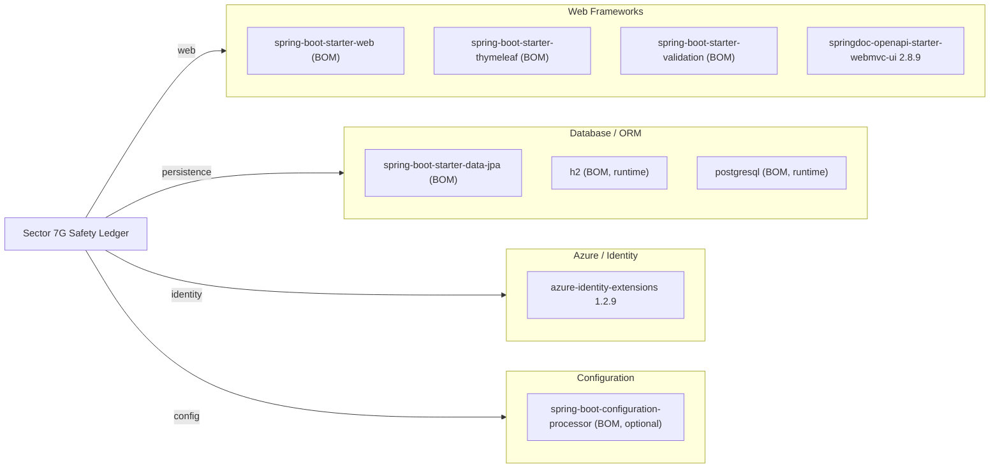

# Dependency Map

## Dependencies

<!-- mermaid-checked: no \n, no em-dash/en-dash, no {} in labels, subgraphs are id["label"], arrows are -->|"label"|, all subgraphs closed by end, ids unique -->

### Dependency Summary

| Category | Library | Version | Scope | Purpose |
|---|---|---|---|---|
| Web Frameworks | spring-boot-starter-web | BOM-managed | compile | Spring MVC, embedded Tomcat (11.0.24 override) |
| Web Frameworks | spring-boot-starter-thymeleaf | BOM-managed | compile | Server-side HTML templating |
| Web Frameworks | spring-boot-starter-validation | BOM-managed | compile | Bean Validation (Jakarta Validation) |
| Web Frameworks | springdoc-openapi-starter-webmvc-ui | 2.8.9 | compile | OpenAPI 3 / Swagger UI |
| Database / ORM | spring-boot-starter-data-jpa | BOM-managed | compile | Spring Data JPA, Hibernate ORM |
| Database / ORM | h2 | BOM-managed | runtime | In-memory database (dev/test profile) |
| Database / ORM | postgresql | BOM-managed | runtime | PostgreSQL JDBC driver (production) |
| Azure / Identity | azure-identity-extensions | 1.2.9 | compile | Azure Managed Identity / Entra authentication for JDBC |
| Configuration | spring-boot-configuration-processor | BOM-managed | compile (optional) | Generates metadata for @ConfigurationProperties |

### BOM and Version Management

All Spring Boot starters are version-managed through the `spring-boot-starter-parent` BOM at version **4.0.7**. The BOM-managed Tomcat version (11.0.22) is explicitly overridden via `<tomcat.version>11.0.24</tomcat.version>` to patch CVE-2026-55956. `springdoc-openapi-starter-webmvc-ui` and `azure-identity-extensions` carry explicit versions not covered by the Spring Boot BOM.

---

## Test Dependencies

| Library | Version | Purpose |
|---|---|---|
| spring-boot-starter-test | BOM-managed | Core test slice: JUnit 5, Mockito, AssertJ, Spring Test |
| spring-boot-starter-webmvc-test | BOM-managed | @WebMvcTest / @AutoConfigureMockMvc slice (Spring Boot 4 split) |
| spring-boot-starter-data-jpa-test | BOM-managed | @DataJpaTest slice (Spring Boot 4 split) |
| spring-boot-testcontainers | BOM-managed | Testcontainers integration with Spring Boot test context |
| testcontainers-junit-jupiter | BOM-managed | JUnit 5 Testcontainers extension |
| testcontainers-postgresql | BOM-managed | PostgreSQL Testcontainers module |

---

## Vulnerability Flags

| Library | Finding | Detail |
|---|---|---|
| spring-boot-starter-parent 4.0.7 | Tomcat CVE override applied | BOM-managed Tomcat 11.0.22 is vulnerable to CVE-2026-55956 (security constraints ignored for default servlet). Patched by explicit override to 11.0.24. Monitor for Spring Boot BOM update to absorb the fix. |
| azure-identity-extensions 1.2.9 | Review recommended | Not BOM-managed; pinned explicitly. Verify against latest Azure SDK release for any security advisories. |
| springdoc-openapi-starter-webmvc-ui 2.8.9 | Review recommended | Not BOM-managed; pinned explicitly. Confirm no known CVEs in Swagger UI bundled assets. |
| h2 (runtime) | Dev/test use only | H2 should remain runtime-scoped and must not be reachable in production. Confirm H2 console is disabled in production profile (`spring.h2.console.enabled=false`). |
