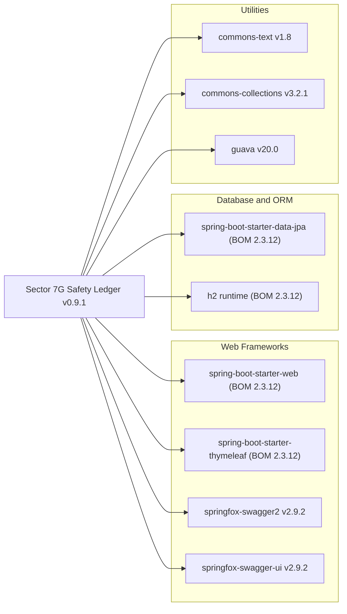

# Dependency Map

This Spring Boot 2.3.12.RELEASE application targeting Java 8 carries nine runtime/compile dependencies across three functional categories, plus two test-scoped dependencies — several of which are outdated or end-of-life.

## Dependencies

<!-- mermaid-checked: no \n, no em-dash/en-dash, no {} in labels, subgraphs are id["label"], arrows are -->|"label"|, all subgraphs closed by end, ids unique -->

### Dependency Summary

| Category | Count | Key Libraries | Notes |
|---|---|---|---|
| Web Frameworks | 4 | spring-boot-starter-web, spring-boot-starter-thymeleaf, springfox-swagger2, springfox-swagger-ui | SpringFox 2.9.2 is unmaintained and incompatible with Spring Boot 3 |
| Database and ORM | 2 | spring-boot-starter-data-jpa, h2 | H2 is in-memory only; not suitable for production |
| Utilities | 3 | commons-text, commons-collections, guava | All three versions carry known CVEs |
| **Total** | **9** | | |

### Version and Compatibility Risks

The parent BOM is Spring Boot **2.3.12.RELEASE**, which reached end-of-life in August 2021 and no longer receives security patches. The declared Java source/target is **1.8** (Java 8), which is itself EOL on most distributions without a commercial support contract. **SpringFox 2.9.2** has been abandoned upstream; the Spring Boot 3 ecosystem requires migration to `springdoc-openapi`. **commons-text 1.8** is affected by CVE-2022-42889 (Text4Shell, CVSS 9.8). **commons-collections 3.2.1** is affected by the long-standing deserialization gadget chain (CVE-2015-6420 and follow-ons). **guava 20.0** predates numerous security and API-breaking fixes (current stable is 33.x). All three utility libraries should be patched to their latest stable releases before any migration work proceeds.

### Notable Observations

- The BOM-managed Spring Boot version controls the effective versions of all `spring-boot-starter-*` and H2 artifacts; upgrading to Spring Boot 3.x will cascade version changes to those libraries automatically.
- SpringFox has no Boot 3-compatible release; `springdoc-openapi` (v2.x) is the direct replacement and must be adopted before the framework upgrade.
- H2 is used as the sole datastore with `scope=runtime`, indicating no production-grade persistence — a significant architectural gap for a safety-critical ledger application.
- Three of nine runtime dependencies have CVEs rated high or critical severity, making dependency remediation the highest-priority pre-migration task.

## Test Dependencies

| Artifact | Group | Version | Notes |
|---|---|---|---|
| spring-boot-starter-test | org.springframework.boot | BOM 2.3.12 | Pulls in JUnit 5 (Jupiter) transitively, but project explicitly re-adds JUnit 4 |
| junit | junit | BOM-managed (4.13.x) | JUnit 4 — marked for migration to JUnit 5 |

**Total test-scoped dependencies: 2**

The explicit re-declaration of `junit:junit` alongside `spring-boot-starter-test` suggests the project deliberately runs JUnit 4 tests, bypassing the JUnit 5 engine that Boot 2.3+ includes by default. This dual-runner setup must be resolved during any framework upgrade: JUnit 4 tests should be migrated to JUnit 5 (`@ExtendWith`, `@Test` from `org.junit.jupiter`) before upgrading to Spring Boot 3, since the `junit-vintage-engine` is not included by default in Boot 3's test starter.
