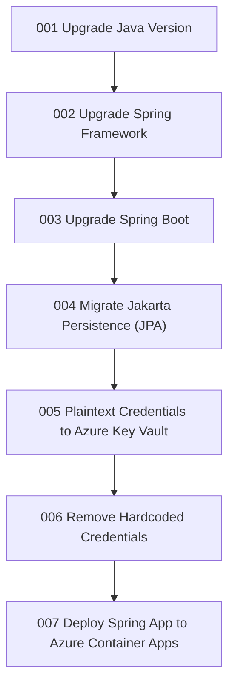

# Modernization Plan: Springfield Azure Modernization

**Project**: sector-7g-safety-ledger

**Assessment Report**: `report-20260714100449`

---

## Technical Framework

- **Language**: Java 1.8 (end of support)
- **Framework**: Spring Boot 2.3.12.RELEASE (end of OSS support), Spring Framework 5.x
- **Build Tool**: Maven
- **Database**: H2 (via Spring Data JPA / Jakarta Persistence)
- **Key Dependencies**: Spring Boot Starter Web, Spring Boot Starter Data JPA, Spring Boot Starter Thymeleaf

---

## Overview

This migration modernizes the Sector 7G Safety Ledger application and prepares it to
run securely on Azure. The application currently runs on an end-of-support Java 8
runtime with an end-of-life Spring Boot 2.3 stack and stores secrets in plaintext.
The new architecture will:

- Move the application onto supported Java, Spring Framework, and Spring Boot versions
  for ongoing security patches and Azure compatibility.
- Eliminate plaintext and hard-coded credentials by adopting Azure Key Vault and secure
  configuration, improving the application's security posture and CRA compliance.
- Deploy the modernized application to a managed Azure hosting platform.

The migration follows a phased approach: runtime and framework upgrades first, then
security and credential hardening, and finally deployment to Azure.

---

## Migration Impact Summary

| Application            | Original Service        | New Azure Service     | Authentication   | Comments                                   |
|------------------------|-------------------------|-----------------------|------------------|--------------------------------------------|
| sector-7g-safety-ledger | Plaintext config secret | Azure Key Vault       | Managed Identity | Move password out of application.properties |
| sector-7g-safety-ledger | Hard-coded Java secrets  | Secure configuration  | Managed Identity | Remove secrets from SecretConstants.java    |
| sector-7g-safety-ledger | On-premises hosting      | Azure Container Apps  | Managed Identity | Containerize and deploy the Spring app      |

---

## Migration Phases

### Phase 1 — Runtime & Framework Upgrade
Bring the runtime and framework stack to supported versions before any Azure changes.
- `001-upgrade-java-version` — Upgrade Java from 1.8 to a supported LTS version.
- `002-upgrade-spring-framework` — Upgrade Spring Framework to a supported major version.
- `003-upgrade-spring-boot` — Upgrade Spring Boot from 2.3.12 to a supported major version.
- `004-transform-jakarta-persistence-to-azure` — Migrate the Jakarta Persistence (JPA) layer to be Azure-ready.

### Phase 2 — Security & Credential Hardening
Remove insecure credential handling.
- `005-transform-migration-plaintext-credential-to-azure-keyvault` — Move plaintext config secrets to Azure Key Vault.
- `006-transform-remove-hardcoded-credentials` — Remove hard-coded secrets from Java source code.

### Phase 3 — Deployment to Azure
Ship the modernized application.
- `007-deployment-spring-cloud-app-to-azure` — Containerize and deploy to Azure Container Apps.

---

## Task Dependencies

---

## Selected Assessment Categories

| Category                                   | Issue(s) Addressed                                                                                   | Task                                                       | kbId                                   |
|--------------------------------------------|------------------------------------------------------------------------------------------------------|------------------------------------------------------------|----------------------------------------|
| Java Version Upgrade                       | Java Version Has Reached the End of Support                                                           | 001-upgrade-java-version                                    | java-version-upgrade                   |
| Framework Upgrade (Spring Framework)       | Spring Framework Version Has Reached the End of OSS Support                                           | 002-upgrade-spring-framework                               | spring-framework-upgrade               |
| Framework Upgrade (Spring Boot)            | Spring Boot Version Has Reached the End of OSS Support                                                | 003-upgrade-spring-boot                                    | spring-boot-upgrade                    |
| Jakarta Migration (Jakarta Persistence)    | Detects usage of Jakarta Persistence (JPA) APIs                                                       | 004-transform-jakarta-persistence-to-azure                | —                                      |
| Local Credential                           | Password found in configuration file                                                                 | 005-transform-migration-plaintext-credential-to-azure-keyvault | plaintext-credential-to-azure-keyvault |
| Hardcoded Credential                       | CRA: Hard-coded password in Java source code; CRA: Hard-coded API key or secret in Java source code  | 006-transform-remove-hardcoded-credentials                | —                                      |
| Spring Migration (Spring Cloud)            | Server port configuration found                                                                      | 007-deployment-spring-cloud-app-to-azure                  | —                                      |

---

## Open Questions & Questionnaire

- [ ] Target Java LTS version (e.g., 21 vs 25) and matching Spring Boot/Spring Framework majors — the kbId-backed upgrade tasks will select compatible supported versions; confirm if a specific target is required.
- [ ] Target Azure database service for the Jakarta Persistence (JPA) layer (currently H2) — confirm the intended managed database (e.g., Azure Database for PostgreSQL/MySQL, Azure SQL).
- [ ] Azure Container Apps hosting details (subscription, resource group, region) will be gathered at deployment time.
