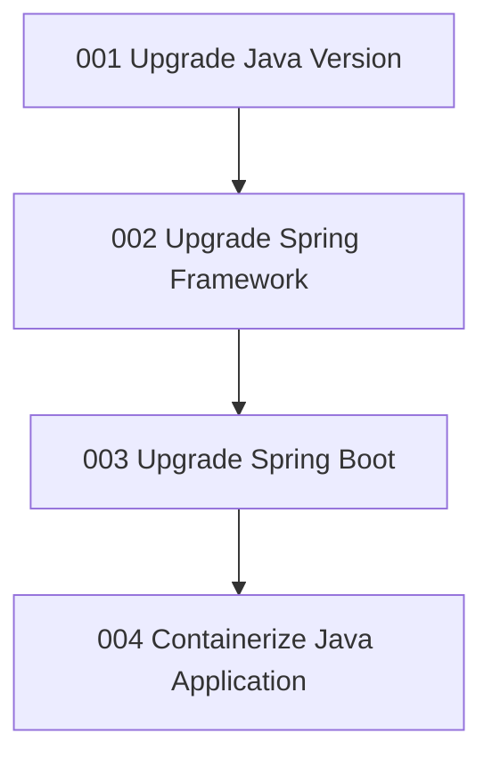

# Modernization Plan: Springfield Upgrade and Containerization

**Project**: sector-7g-safety-ledger

**Assessment Report**: `report-20260714101315`

---

## Technical Framework

- **Language**: Java 1.8 (end of support)
- **Framework**: Spring Boot 2.3.12.RELEASE (end of OSS support), Spring Framework 5.x
- **Build Tool**: Maven
- **Database**: H2 (via Spring Data JPA)
- **Key Dependencies**: Spring Boot Starter Web, Spring Boot Starter Data JPA, Spring Boot Starter Thymeleaf, SpringFox Swagger 2.9.2

---

## Overview

This migration brings the Sector 7G Safety Ledger application onto supported runtime and
framework versions and prepares it for container-based hosting on Azure. The application
currently runs on an end-of-support Java 8 runtime with an end-of-life Spring Boot 2.3
stack and has no container definition. The new architecture will:

- Move the application onto a supported Java LTS runtime for ongoing security patches and
  Azure compatibility.
- Upgrade the Spring Framework and Spring Boot stack to supported major versions,
  including the Jakarta EE namespace migration.
- Add a container definition so the modernized application is ready for replatforming to
  Azure Container Apps or Azure Kubernetes Service.

The migration follows a phased approach: runtime and framework upgrades first, then
containerization once the application runs on the modernized stack.

---

## Migration Impact Summary

| Application            | Original Service      | New Azure Service       | Authentication   | Comments                                          |
|------------------------|-----------------------|-------------------------|------------------|---------------------------------------------------|
| sector-7g-safety-ledger | Java 8 runtime        | Supported Java LTS      | N/A              | Upgrade end-of-support runtime                    |
| sector-7g-safety-ledger | Spring Boot 2.3.12    | Supported Spring Boot   | N/A              | Upgrade end-of-life framework stack               |
| sector-7g-safety-ledger | No container image    | Container-ready (ACA/AKS)| Managed Identity | Add Dockerfile for container-based replatforming  |

---

## Migration Phases

### Phase 1 — Runtime & Framework Upgrade
Bring the runtime and framework stack to supported versions before containerization.
- `001-upgrade-java-version` — Upgrade Java from 1.8 to a supported LTS version.
- `002-upgrade-spring-framework` — Upgrade Spring Framework to a supported major version.
- `003-upgrade-spring-boot` — Upgrade Spring Boot from 2.3.12 to a supported major version.

### Phase 2 — Containerization
Make the modernized application container-ready.
- `004-containerization-java-application` — Create a Dockerfile for container-based replatforming.

---

## Task Dependencies

---

## Selected Assessment Categories

| Category                              | Issue(s) Addressed                                         | Task                                  | Solution                                                                        |
|---------------------------------------|------------------------------------------------------------|---------------------------------------|---------------------------------------------------------------------------------|
| Containerization                      | No Dockerfile found                                        | 004-containerization-java-application | Containerize Java Application for Container Readiness [kbId: containerization-copilot-agent] |
| Java Version Upgrade                  | Java Version Has Reached the End of Support                | 001-upgrade-java-version              | Upgrade Java Version [kbId: java-version-upgrade]                                |
| Framework Upgrade (Spring Framework)  | Spring Framework Version Has Reached the End of OSS Support | 002-upgrade-spring-framework          | Upgrade Spring Framework Version [kbId: spring-framework-upgrade]                |
| Framework Upgrade (Spring Boot)       | Spring Boot Version Has Reached the End of OSS Support      | 003-upgrade-spring-boot               | Upgrade Spring Boot Version [kbId: spring-boot-upgrade]                          |

---

## Open Questions & Questionnaire

- [ ] Target Java LTS version (e.g., 21 vs 25) and matching Spring Boot / Spring Framework majors — the kbId-backed upgrade tasks will select compatible supported versions; confirm if a specific target is required.
- [ ] Target container host (Azure Container Apps vs Azure Kubernetes Service) — the Dockerfile is host-agnostic; confirm the intended platform if it affects base image or port configuration.
